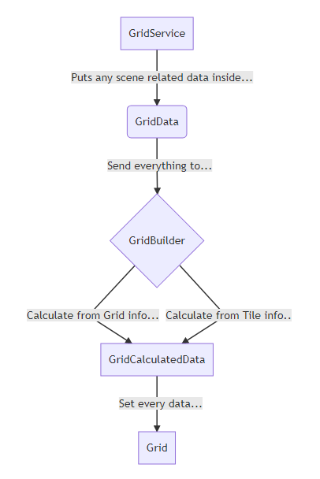

# Grid System

In order to easily be able to manipulate a tile based rpg game, this system was created.
It's a low level static grid that can sustain pratically anything. In this documentation,
you'll see how to start it, use it and what are the possible behaviors or issues the system
can encounter.

## Initial Setup 

The Grid is almost all static function, so for it to make our editable and dynamic data, it
needs to update itself whenever we need it. In order to make sure everything is setup correctly,
be sure the GridService will be there at run time. You can do that in 2 different maner :

1. Put the prefab in to the scene (reason why is explained below)

2. Make sure to link the prefab in the service bank

N.B. for more information about services, head over 

## Customize your Grid

There are 2 ways you can can edit the way your grid is. You can use Tile Info or Grid Info.

### Grid Info

Grid information are the ones describing the entire grid entity. You need to move 2 corners
location to define the area your grid will occupy. Then, you need to specify the number of
tiles there is in a single row, it's the width of the grid. With this, we can easily generate
a grid. If you decide to use this method, you'll probably need to use the method 1 of the setup
section since there'll be 2 Location Game Object you can move around. You'll also be able to see
a gizmo of what it'll look like when pressing play.

### Tile Info (In Developpement)

Tile Information define the width and height of a tile. You'll also need the center point of the grid, 
and the number of tiles you want. This might change since the system still needs to be done. It's a great
way to be able to manipulate a grid without changing the tiles you decided tp have. If the game need 4x4
tiles, whatever the grid, this needs to stay the same no matter what.

Here is a visualization of how the system initialize itself and make the Grid static class usable : 



(Graph was made with the use of https://mermaidjs.github.io/mermaid-live-editor/)

## Using the Grid

Most of the time, when using the grid, you'll be interacting with the Grid class. It contains basic static
tile identification function. It doesn't interpret the grid to get more complex informations. This is the
job of the GridTools.cs. You can get neighboors, tiles in an aoe, shortest paths. It's goal is to do the work
in your place. Here are some examples :

```
transform.position = Grid.GetTilePosition(tileID);
```

As you can see in this last example, to identify the tiles, we're using a TileID. It's a generic class that's
really easy to add in your code. By defining it that way, the whole project is going to reference this type and
thus it'll be easier for every system to communicate clearly tile data. So in a typical case, you'll only pass the
TileID in your system, and with every TileID, it's really straight forward to get informations.
